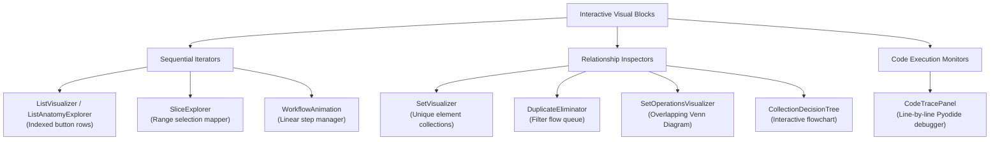

# Project Master Specification (MASTER_SPEC.md)

This document serves as the permanent project specification for the **Digital Interactive Notes** platform. Future prompts and agents can reference this specification to ensure architectural, styling, and design consistency across all module additions and lesson creations without repeating instructions.

---

## 1. Project Overview

### Purpose
The platform delivers high-fidelity, interactive, and data-driven educational content for learning programming. It combines structured textbook narrative, diagnostic sandboxes, and visual simulations.

### Educational Philosophy
- **Concept-First**: Concrete problem stories precede code syntax.
- **Active Learning**: Students learn through modification, real-time code executions, and interactive visual supplements.
- **Diagnostic Feedback**: Immediate, clean errors guide correction rather than silent failures.
- **Immediate Contextualization**: Lessons conclude with industry relevance, think-like-an-engineer prompts, and guided practice.

### Target Audience
Beginner programmers, agricultural technology professionals, and students looking for hands-on programming experience.

### Agritech Context
All lessons are situated in a **Smart Farm** context. Examples, story problems, datasets, and visualizations model real-world farming telemetry:
- Telemetry readings (soil moisture, temperature, pH levels, humidity, air quality).
- Automated systems (irrigation controllers, gateway routers, drone inspection logs).
- Data grouping (barn sensor registries, crop rotations, field coordinate maps).

---

## 2. Technology Stack

- **Core**: React 19 (`react`, `react-dom`) and TypeScript (`typescript`).
- **Build Tool**: Vite 8 (`vite`).
- **CSS Preprocessor**: Sass (`sass`).
- **UI Components**: IBM Carbon Design System (`@carbon/react` for UI widgets, forms, accordions, number inputs, tabs).
- **Icons**: IBM Carbon Icons (`@carbon/icons-react`).
- **Python Execution Engine**: Self-hosted [Pyodide](https://pyodide.org/) (v314.0.3) running inside a background Web Worker (`python.worker.ts`). Captures program stdout, stderr, execution traces, simulated inputs, and code exceptions in real time.
- **Animations**: Highly optimized, hardware-accelerated pure CSS transitions and keyframes (`@keyframes`) for maximum rendering performance, minimizing bundle size and execution latency.

---

## 3. Project Architecture

### Folder Structure
The repository strictly adheres to the following organization:

```text
├── components/                     # React UI Components
│   ├── course/                     # Navigation sidebar, course layouts, progress indicators
│   ├── learning/                   # Educational cards, playgrounds, visualizers, decision tree
│   ├── navigation/                 # AppShell header, client-side custom router
│   ├── pages/                      # Page containers (Overview, Workspace, Assignments, Modules)
│   └── providers/                  # Context providers (Pathname, Pyodide runtimes)
├── content/                        # Curriculum Database & Data Configs
│   ├── development-packs/          # Data parameters, debug logs, exercises, and examples
│   ├── course-framework.ts         # Course framework declaration (modules, lessons, progress)
│   ├── course.ts                   # Page route definition mappings
│   ├── lessons.ts                  # Published lessons list resolver
│   └── module-X.ts                 # Module curriculum data containing quiz and practices
├── docs/                           # Platform Documentation
│   └── MASTER_SPEC.md              # This Master Specification file
├── public/                         # Static Assets (Pyodide source files, Web Worker assets)
├── src/                            # Entry points & Global styles
│   ├── App.tsx                     # Top-level client router and route manager
│   ├── main.tsx                    # React mount declaration
│   └── styles/
│       └── globals.scss            # Global style sheet containing all lesson-specific rules
├── tests/                          # Integration testing suites
│   └── rendered-html.test.mjs      # Playwright/Pyodide node runner validation script
├── tsconfig.json                   # TypeScript configuration
└── package.json                    # Dependencies & Script definitions
```

### Routing & Client Router
- A custom, lightweight router handles rendering based on path names (`App.tsx`).
- `<Link>` (`components/navigation/client-router.tsx`) overrides standard anchor tags, triggers `PopStateEvent`, pushes history state, and performs smooth scrolling when navigating to page hashes.
- Pathname state is consumed via `usePathname` (`components/navigation/usePathname.ts`).

### Lesson Architecture
- Each lesson is defined as a structured metadata object (`LessonDocument`) in the curriculum database (`content/module-X.ts`).
- Lessons are linked to a **Development Pack** (inside `content/development-packs/`) containing structured story narratives, creation examples, methods, comparisons, agritech telemetry arrays, and interactive debug code solutions.
- Renders via `LessonRenderer.tsx` which dispatches to lesson-specific components (`SetsLessonRenderer`, `TupleLessonRenderer`, etc.) when custom visualizations are defined.

---

## 4. Reusable Educational Components

The following core components in `components/learning/` must be reused to maintain continuity:

| Component | Purpose / Design |
| --- | --- |
| `LessonHero` | Header section showing module coordinates, lesson title, description, tags (Difficulty, Duration), and prerequisites. |
| `LearningObjectivesCard` | Shows numerical, double-digit numbered checklist items (e.g. `01`, `02`) of the learning outcomes. |
| `IndustryInsightCard` | Tile card with a lightbulb icon highlighting why developers care about this concept in the industry. |
| `CodePlayground` | Contains code text area, run/reset buttons, live console output box, and hooks into `renderSupplement` for live visualizers. |
| `PracticeCard` | Carbon tabs sorting Easy, Medium, and Challenge tasks. Each task expands to show guidance hints using an accordion. |
| `QuizCard` | Interactive radio buttons assessing learning retention. Shows immediate green/red success states upon submit. |
| `AssignmentCard` | Structured bullet lists outlining concrete deliverables students must submit. |
| `SummaryCard` | Concluding takeaways, outlining items learned. |
| `WhatsNextCard` | Teasers explaining the next lesson. |
| `CollectionDecisionTree` | Interactive quiz wizard mapping the decision-making flow to help users choose between Variables, Lists, Tuples, Sets, and Dictionaries. |

---

## 5. Spacing, Typography & Theme Rules

All elements align with the **IBM Carbon Design System** using custom classes under their respective lesson namespace (e.g., `.sets-development-pack`):

### Spacing System
Spacing is configured hierarchically using standard values for consistency:
- **Card Margins**: Outer page layouts separate core sections using `1.5rem` or `2rem` vertical margins.
- **Section Paddings**: Component card containers use `1.5rem` or `2rem` padding inside tiles.
- **Gutters & Grids**: Elements inside simulator grids use a `1rem` or `0.75rem` gap to align controls and displays.
- **Compact Margins**: Subsections or helper labels utilize `0.5rem` to `0.75rem` margins.

### Typography Hierarchy
Typography uses the IBM Plex font families and maintains strict size and weight standards:
- **Lesson Titles**: Sized at `clamp(1.5rem, 5vw, 2.5rem)` using a bold weight.
- **Section Headings**: `h2` titles are sized at `1.25rem` to `1.5rem` in semi-bold weight.
- **Subheadings**: `h3` labels inside simulation cards are sized at `1rem` to `1.15rem`.
- **Telemetry Indicators**: High-visibility metric numbers are rendered large, using `clamp(2rem, 7vw, 4.5rem)` or bold `1.5rem` numbers.
- **Section Helpers**: Sized at `.65rem` to `.75rem`, uppercase, letter-spaced, using help text colors (e.g., `var(--cds-text-secondary)` or `var(--cds-text-helper)`).
- **Code Fonts**: Monospace codes (`var(--cds-code-01-font-family)`) are sized at `0.75rem` to `0.85rem` inside editor screens and chips.

### Theme & Contrast Rules (Light & Dark)
The interface automatically responds to theme modes using system variables:
- **Background Layering**: Cards sit on `--cds-layer-02` (lighter gray/dark background) placed over the page base `--cds-layer-01` (darker gray/light background).
- **Interactive Layers**: Selected states get `var(--cds-layer-selected-01)` or `var(--cds-layer-active-01)` variables.
- **Borders**: Thin subheadings utilize `1px solid var(--cds-border-subtle-01)` for visual structure.
- **Semantic Text**: Error alerts utilize error variables (`var(--cds-support-error)`), success elements use green (`var(--cds-support-success)` or `var(--brand-green)`), and warnings use yellow (`var(--cds-support-warning)`).

---

## 6. Carbon Component Integration Guidelines

Carbon Design System controls are used to build interactive panels. The standard mappings are:
- **Buttons (`Button`)**: Trigger events or reset simulators. Use standard size (`size="md"` or `size="sm"`) and matching styles (`kind="primary"`, `kind="secondary"`, `kind="tertiary"`, or `kind="ghost"`).
- **Form Controls (`TextInput`, `NumberInput`)**: Collect replacement indices, custom telemetry additions, or slider values. Ensure unique labels and descriptive placeholder properties are supplied.
- **Containers (`Tile`)**: Render highlights, calculation results, or warning boxes.
- **Tab Managers (`Tabs`, `Tab`, `TabList`, `TabPanels`, `TabPanel`)**: Organize Practice Cards or multi-step tutorial examples.
- **Accordions (`Accordion`, `AccordionItem`)**: Compress guidance hints or detailed steps in tutorials (e.g. `GuidedPracticeLab`).
- **Tags (`Tag`)**: Indicate exercise difficulties (`type="green"`, `type="blue"`, `type="purple"`), error states (`type="red"`), or outputs (`type="magenta"`).

---

## 7. Reusable Visualization Components

Lessons use dedicated visual blocks. Future lessons must adopt these patterns:



### Sequential Iterators & Index Mappers
- **`ListVisualizer`**: Renders indexed arrays as row-oriented buttons with zero-based indexes on top (`index 0`) and physical positions on the bottom (`position 1`).
- **`ListAnatomyExplorer`**: Wraps visualizer rows with button selectors to output specific values at chosen indexes dynamically (e.g. `moisture[index]`).
- **`SliceExplorer`**: Interactive slide handlers that isolate index ranges (`A[start:stop]`) and highlight matching elements visually.
- **`WorkflowAnimation`**: Stepped progress timeline with linear buttons displaying specific explanations at each state.

### Unique & Relationship Inspectors
- **`SetVisualizer`**: Renders items inside standard set curly braces `{ ... }`. Highlights existing items with error classes if duplicate additions are attempted.
- **`DuplicateEliminator`**: Flow diagram simulating a queue pipeline: Incoming Value -> Check unique -> Accept (turns green/success) / Reject (turns red/error).
- **`SetOperationsVisualizer` (Venn Diagram)**: Represents overlapping circular regions with elements. Selecting operators highlights corresponding regions in real time:
  - **Union**: Highlights Circle A, Overlap, and Circle B.
  - **Intersection**: Highlights Overlap region only.
  - **Difference**: Highlights Circle A's exclusive crescent region.
  - **Symmetric Difference**: Highlights Circle A and Circle B's crescent regions, leaving overlap dark.
- **`MembershipExplorer`**: Triggers membership tests (`x in A`), flashes searching indicators, and displays validation badges.

### Code Execution Monitors
- **`CodeTracePanel`**: Interacts with `usePythonRunner` execution logs to show line-by-step program execution. Offers Play/Pause, Step Forward/Backward, Replay controls, call stack lists, local variables tables, and stdout buffers.

---

## 8. Interactive Playground Standards

Every Code Playground follows strict standards to ensure safe, interactive browser-based Python execution:

### Editor & Input Controls
- Code input uses Carbon `<TextArea>` containing the starter code.
- Blocking hooks (`validateCode(code: string)`) validate inputs before runtime. Block execution if:
  - Unordered sets are accessed by indices (e.g. `A[0]`).
  - Dictionary empty brackets (`{}`) are confused with sets (`set()`).
  - Immutable tuple elements are modified.
- Blocks execution by rendering a Carbon `<InlineNotification kind="warning" />` and disabling the "Run code" button.

### Execution Output & Pyodide Worker
- Triggers execution using the `run(code)` callback from the `usePythonRunner` hook.
- Preparation and compilation occur inside the background worker thread (`python.worker.ts`).
- Output panel renders results inside `<pre><code>` blocks, updating loading state dynamically.

### Playground Supplement Integration
- Playgrounds must implement `renderSupplement` to parse the user's code and display visual representations (arrays, sets, tables) below the output panel.
- Parses values using regex scripts (e.g. `parseSimpleList` or `parseTupleTuple`), resolving:
  - Variable names.
  - List/Set size.
  - Active selected item.
  - Maximum/Minimum values.

---

## 9. Comparison & Table Standards

To display data differences (e.g., list vs tuple vs set properties), adopt the grid-based HTML table layout:
- **Structure**: Rendered using standard `div` tags with explicit role variables (`role="table"`, `role="row"`, `role="columnheader"`, `role="cell"`).
- **Header formatting**: `.comparison-heading` gets Layer-02 backgrounds and bold labels.
- **Grids**: Standard columns use `grid-template-columns: repeat(N, minmax(0, 1fr))` for perfect alignment.
- **Visual styling**: Row fields separate using a bottom border (`1px solid var(--cds-border-subtle-01)`).

---

## 10. Debug Challenge Standards

Debug exercises must enforce error repairs before code execution:
- **Card Wrapper**: Renders inside a `.problem-debug-challenges` container.
- **State Details**: Challenges display title, mistakes count tag (`Tag type="red"`), and prompt instructions.
- **Source Code**: Erroneous code is displayed inside `<pre><code>` blocks.
- **Solution Triggers**: A Carbon button toggles between "Show solution" and "Hide solution".
- **Conditional Panels**:
  - Hidden state: Shows guidance advice (`hiddenGuidance`).
  - Visible state: Shows the correct code inside a `<pre><code>` block.

---

## 11. Quiz Standards

Every lesson features a diagnostic checking block:
- **Header**: Sized `h2` under a quiz icon.
- **Questions**: Organized in a `.quiz-question-list` container. Each question gets a badge (`Tag type="magenta"`) indicating its coordinate name.
- **Radio Buttons**: Choices render in a Carbon `RadioButtonGroup` (vertical orientation).
- **Validation feedback**: Checking answers disables choices and shows a feedback panel (`.quiz-question-note`).
  - Correct choice: `.is-correct` (green border, success message).
  - Incorrect choice: `.is-incorrect` (red border, review suggestion).

---

## 12. Practice Section Standards

Practice blocks must structure challenges by difficulty:
- **Tabs Layout**: Carbon `Tabs` organize tasks by level: Easy -> Medium -> Challenge.
- **State Tags**: Each task gets tagged based on level (`Tag type="green"`, `type="blue"`, or `type="purple"`).
- **Accordion Guidance**: Students can click on Carbon `Accordion` (`align="start"`) -> `AccordionItem` -> "Show guidance" to expand hints and hints arrays.

---

## 13. Animation & Timing Specifications

Custom CSS keyframe animations handle micro-interactions:
- **`.animate-bounce-error`**: Bounces duplicate chips to signal rejection.
  ```css
  @keyframes bounce-error {
    0%, 100% { transform: scale(1); }
    50% { transform: scale(1.15); background-color: var(--cds-support-error); }
  }
  ```
- **`.animate-added`**: Zooms in new elements.
  ```css
  @keyframes added-flash {
    0% { transform: scale(0.8); background-color: var(--cds-support-success); }
    100% { transform: scale(1); }
  }
  ```
- **`.animate-shake`**: Shakes lookups that fail membership testing.
  ```css
  @keyframes shake {
    0%, 100% { transform: translateX(0); }
    25% { transform: translateX(-6px); }
    75% { transform: translateX(6px); }
  }
  ```
- **`.animate-flow`**: Slides queue blocks downwards through pipeline lanes.
  ```css
  @keyframes flow-down {
    0% { transform: translateY(-30px); opacity: 0; }
    100% { transform: translateY(0); opacity: 1; }
  }
  ```
- **Timing Speeds**:
  - Hover states and active tabs: `200ms` or `300ms` linear.
  - Step transitions (pipeline flow, Venn diagrams): `500ms` to `1200ms` ease.

---

## 14. Coding Standards

- **TypeScript Strictness**: Interfaces must explicitly define properties (e.g. `SetsDevelopmentPack`, `TupleDevelopmentPack`). Never use `any`.
- **Absolute / Alias Imports**: Always import using `@/` path prefixes (e.g. `import { Link } from "@/components/navigation/client-router"`).
- **Naming Conventions**:
  - React components: PascalCase (e.g. `SetsLessonRenderer.tsx`, `DuplicateEliminator`).
  - Blocks and utilities: camelCase (e.g. `usePythonRunner.ts`, `validateSetsCode`).
  - Styles: kebab-case (e.g. `.sets-comparison`, `.set-operations-layout`).
- **Encapsulated Styles**: Keep lesson-specific styles nested under their root container class in `globals.scss` (e.g. `.sets-development-pack { ... }`) to avoid leakage.
- **Unit Test Integrity**: Make sure to update match counts in `tests/rendered-html.test.mjs` as new lessons are appended to avoid breaking build gates.
- **Documentation Preservation**: Maintain docstrings, inline code comments, and annotations in files being modified.
